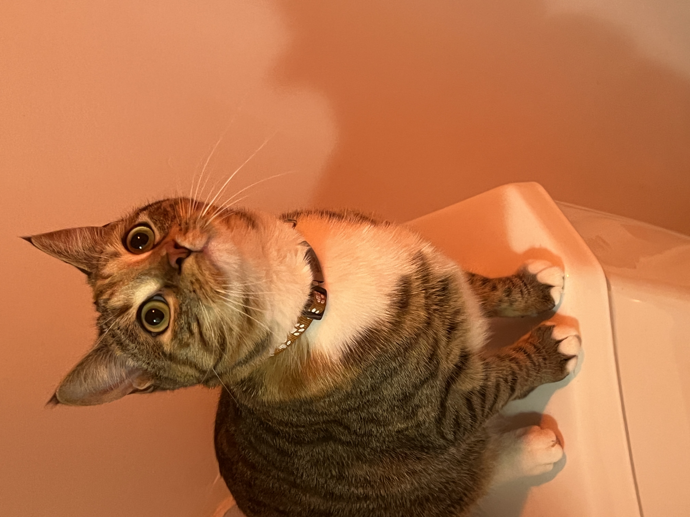
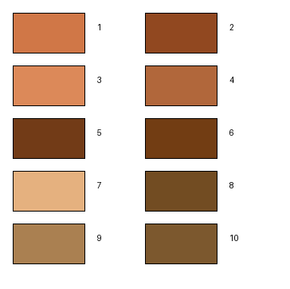
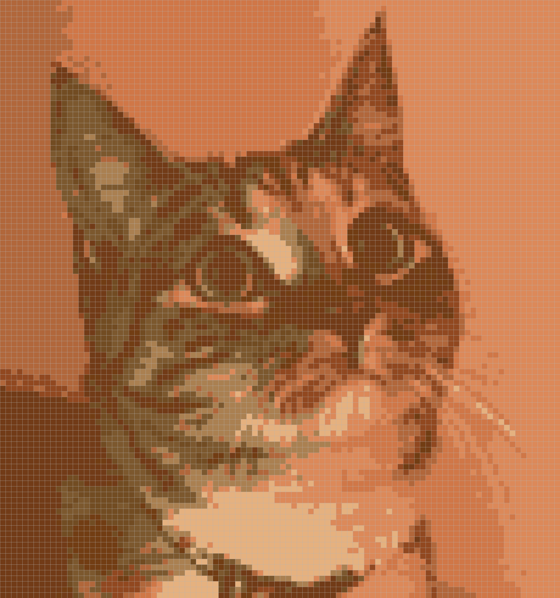

# Color By Number

Generate **color-by-number puzzle images** from input images using Python.

This package converts a source image into:

- a **numbered puzzle template**
- a **color legend (reference palette)**
- a **completed colored mosaic**

The goal is to easily create printable **paint-by-number / color-by-number puzzles**.

---

# Installation

Install the package with pip:

```bash
pip install git+https://github.com/KeonZhao/color_by_number.git
```

Dependencies will be installed automatically.

Main dependencies include:

- numpy
- pillow
- scikit-learn
- scikit-image

---

# Quick Start

```python
from color_by_number import ColorByNumber

cbn = ColorByNumber(
    fig_path="example.jpg",
    number_of_colors=10,
    number_of_blocks=40,
    save_path="outputs"
)

# Generate puzzle template
cbn.generate_mosaic()

# Generate color legend
cbn.generate_reference_color_bar()

# Generate completed solution
cbn.complete_mosaic()

# Save the outputs
cbn.save_mosaic()
```

After running this code, the following folders will be created automatically:

```
outputs/
 ├── puzzle/
 ├── legend/
 └── solution/
```

These contain:

```
puzzle/
  mosaic_puzzle.png

legend/
  reference_color_bar.png

solution/
  mosaic_completed.png
```

- **puzzle** → numbered template to color
- **legend** → number-to-color reference
- **solution** → completed mosaic

---

# Parameters

### `fig_path`

Path to the input image.

Example:

```
fig_path="image.jpg"
```

---

### `number_of_colors`

Number of colors used in the palette.

Typical values:

```
6 – 12   simple puzzle
12 – 20  moderate detail
20+      detailed puzzle
```

---

### `number_of_blocks`

Controls the mosaic resolution.

This is the **number of blocks across the width**.

Typical values:

```
20–40   simple puzzle
40–80   moderate detail
80+     detailed puzzle
```

Higher values produce more detailed puzzles.

---

# Notes on Image Suitability

Not all images are suitable for color-by-number conversion.

Images work best when they contain:

- clear color regions
- simple backgrounds
- moderate contrast
- distinct objects

Images that may produce poor results include:

- highly textured images (grass, sand, fur)
- extremely detailed photographs
- noisy images
- images with thousands of subtle color variations

For best results, use images with **clear shapes and simple composition**.

---

# Example Use Cases

- Paint-by-number puzzles
- Coloring books
- Educational art activities
- Creative coding projects
- Image simplification experiments

## Example

### Input Image



### Puzzle Template


### Color Legend



### Completed Result


---

# License

MIT License